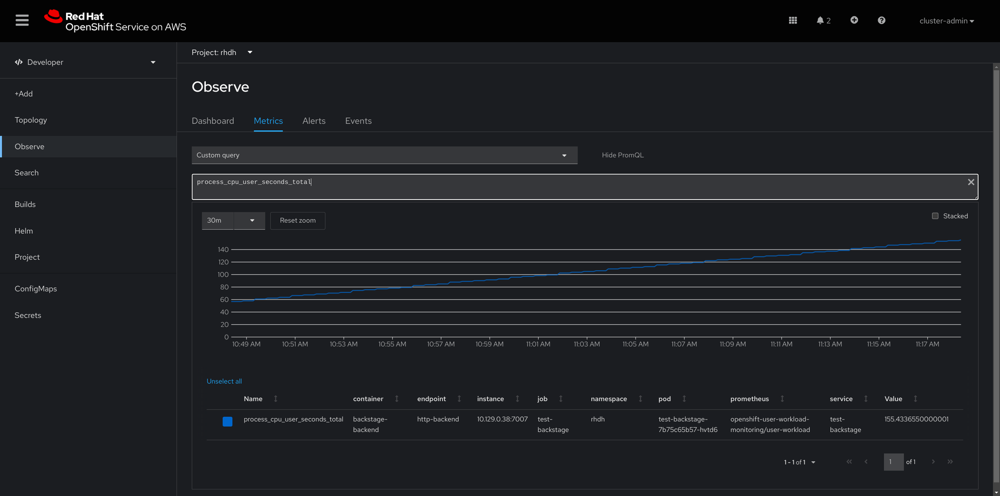

# Metrics Monitoring for RHDH Helm Chart

The RHDH provides a `/metrics` endpoint on port `9464` that provides OpenTelemetry metrics about your Backstage application. This endpoint can be used to monitor your Backstage instance using OpenTelemetry and Grafana.

When deploying RHDH using the [RHDH Helm chart](https://github.com/redhat-developer/rhdh-chart), monitoring for your RHDH instance can be configured using the following steps.

## Prerequisites

- Kubernetes 1.27+ ([OpenShift 4.14+](https://docs.redhat.com/en/documentation/openshift_container_platform/4.14/html-single/release_notes/index#ocp-4-14-about-this-release))
- Helm 3.10+ or [latest release](https://github.com/helm/helm/releases)
- PV provisioner support in the underlying infrastructure
- The [RHDH Helm chart repositories](https://github.com/redhat-developer/rhdh-chart#installing-from-the-chart-repository)

## Metrics Monitoring

### Enabling Metrics Monitoring on OpenShift

To enable metrics monitoring on OpenShift, we need to create a `ServiceMonitor` resource in the OpenShift cluster that will be used by Prometheus to scrape metrics from your Backstage instance. For the metrics to be ingested by the built-in Prometheus instances in OpenShift, please ensure you enabled [monitoring for user-defined projects](https://docs.redhat.com/en/documentation/openshift_container_platform/latest/html/monitoring/configuring-user-workload-monitoring#preparing-to-configure-the-monitoring-stack-uwm).

#### Helm deployment

To enable metrics on OpenShift when deploying with the RHDH Helm chart, you will need to modify the [`values.yaml`](https://github.com/redhat-developer/rhdh-chart/blob/main/charts/backstage/values.yaml) of the Chart.

To obtain the `values.yaml`, you can run the following command:

```bash
helm show values redhat-developer/backstage > values.yaml
```

Then, you will need to modify the `values.yaml` to enable metrics monitoring by setting `upstream.metrics.serviceMonitor.enabled` to true:

```yaml title="values.yaml"
upstream:
  # Other Configurations Above
  metrics:
    serviceMonitor:
      enabled: true
      path: /metrics
      port: http-metrics
```

Then you can deploy the RHDH Helm chart with the modified `values.yaml`:

```bash
helm upgrade -i <release_name> redhat-developer/backstage -f values.yaml
```

You can then verify metrics are being captured by navigating to the OpenShift Console. Go to `Developer` Mode, change to the namespace the showcase is deployed on, selecting `Observe` and navigating to the `Metrics` tab. Here you can create PromQL queries to query the metrics being captured by OpenTelemetry.



### Enabling Metrics Monitoring on Azure Kubernetes Service (AKS)

To enable metrics monitoring for RHDH on Azure Kubernetes Service (AKS), you can use the [Azure Monitor managed service for Prometheus](https://learn.microsoft.com/en-us/azure/azure-monitor/essentials/prometheus-metrics-overview). The AKS cluster will need to have an associated [Azure Monitor workspace](https://learn.microsoft.com/en-us/azure/azure-monitor/containers/prometheus-metrics-enable?tabs=azure-portal).

One method is to configure the metrics scraping of your AKS cluster using the [Azure Monitor _metrics_ add-on](https://learn.microsoft.com/en-us/azure/azure-monitor/containers/prometheus-metrics-scrape-configuration).

The other method is to configure the Azure Monitor _monitoring_ add-on which also allows you to [send Prometheus metrics to the Log Analytics workspace](https://learn.microsoft.com/en-us/azure/azure-monitor/containers/container-insights-prometheus-logs). These metrics can then be queried using [Log Analytics queries](https://learn.microsoft.com/en-us/azure/azure-monitor/containers/container-insights-log-query#prometheus-metrics) as well as be visible in a Grafana instance.

In both methods, we can configure the metrics scraping to scrape from pods based on pod annotations. Follow the steps below for Helm deployment.

#### Helm Deployment for AKS

To add annotations to the backstage pod, add the following to the RHDH Helm chart `values.yaml`:

```yaml title="values.yaml"
upstream:
  backstage:
    # Other configurations above
    podAnnotations:
      # Other annotations above
      prometheus.io/scrape: 'true'
      prometheus.io/path: '/metrics'
      prometheus.io/port: '9464'
      prometheus.io/scheme: 'http'
```

#### Metrics Add-on

For the _metrics_ add-on, we can modify the [`ama-metrics-settings-configmap`](https://github.com/Azure/prometheus-collector/blob/main/otelcollector/configmaps/ama-metrics-settings-configmap.yaml) Config Map and enable pod annotations based scraping for the namespace your showcase instance is in. In the [example Config Map](./configuration_files/ama-metrics-settings-configmap.yaml), change the regex for the `podannotationnamespaceregex` option to match the namespaces you want to scrape from. For more information on how to configure this refer to the [official Azure docs](https://learn.microsoft.com/en-us/azure/azure-monitor/containers/prometheus-metrics-scrape-configuration#customize-metrics-collected-by-default-targets).

Alternatively, we can instead add/modify the `ama-metrics-prometheus-config` Config Map in the `kube-system` namespace of the AKS cluster to configure custom scrape jobs. In the [example Config Map](./configuration_files/ama-metrics-prometheus-config.yaml), please replace the values of namespace with the namespace you deployed the backstage instance into. For more information on how to configure this refer to the [official Azure docs](https://learn.microsoft.com/en-us/azure/azure-monitor/containers/prometheus-metrics-scrape-configuration#configure-custom-prometheus-scrape-jobs).

To view the metrics, you can create a Grafana instance, [configure an Azure Monitor data source plug-in](https://learn.microsoft.com/en-us/azure/azure-monitor/visualize/grafana-plugin#configure-an-azure-monitor-data-source-plug-in) and view the metrics using PromQL queries.

#### Monitoring Add-on

For the _monitoring_ add-on, we will need to add a modified instance of this [Config Map](https://raw.githubusercontent.com/microsoft/Docker-Provider/ci_prod/kubernetes/container-azm-ms-agentconfig.yaml) to the `kube-system` namespace of the AKS cluster. In the [example Config Map](./configuration_files/container-azm-ms-agentconfig.yaml), please replace the values of namespace with the namespace you deployed the backstage instance into. For more information refer to the [official Azure docs](https://learn.microsoft.com/en-us/azure/azure-monitor/containers/container-insights-prometheus-logs?tabs=cluster-wide).

To view the metrics, you can create a Grafana instance, [configure an Azure Monitor data source plug-in](https://learn.microsoft.com/en-us/azure/azure-monitor/visualize/grafana-plugin#configure-an-azure-monitor-data-source-plug-in) and view the metrics using PromQL queries.

Alternatively, you can use [Log Analytics](https://learn.microsoft.com/en-us/azure/azure-monitor/containers/container-insights-log-query#prometheus-metrics) to query the metrics using KQL. The following is an example query to get a custom metric for the Backstage instance:

```kql
let custom_metrics = "custom-metric-name";
InsightsMetrics
| where Namespace contains "prometheus"
| where Name == custom_metrics
| extend tags = parse_json(Tags)
| where tostring(tags['app.kubernetes.io/component']) == "backstage"
```

## Configuration Examples

### Complete Monitoring Configuration

Here's a complete example of a `values.yaml` configuration with monitoring enabled:

```yaml title="values.yaml"
upstream:
  backstage:
    # Add pod annotations for AKS monitoring (if deploying on AKS)
    podAnnotations:
      prometheus.io/scrape: 'true'
      prometheus.io/path: '/metrics'
      prometheus.io/port: '9464'
      prometheus.io/scheme: 'http'
  
  # Enable ServiceMonitor for OpenShift monitoring
  metrics:
    serviceMonitor:
      enabled: true
      path: /metrics
      port: http-metrics
```

### OpenShift-specific Configuration

For OpenShift deployments, focus on the ServiceMonitor configuration:

```yaml title="values.yaml"
upstream:
  # Enable ServiceMonitor for OpenShift Prometheus
  metrics:
    serviceMonitor:
      enabled: true
      path: /metrics
      port: http-metrics
  
  backstage:
    # Other backstage configurations as needed
```

### AKS-specific Configuration

For AKS deployments, focus on pod annotations:

```yaml title="values.yaml"
upstream:
  backstage:
    # Add annotations for Azure Monitor
    podAnnotations:
      prometheus.io/scrape: 'true'
      prometheus.io/path: '/metrics'
      prometheus.io/port: '9464'
      prometheus.io/scheme: 'http'

```

## Troubleshooting

### Metrics Not Appearing

1. **Verify the ServiceMonitor is created** (OpenShift):

   ```bash
   oc get servicemonitor -n <namespace>
   ```

2. **Check if metrics endpoint is accessible**:

   ```bash
   oc port-forward pod/<backstage-pod> 9464:9464
   curl http://localhost:9464/metrics
   ```

3. **Verify pod annotations** (AKS):

   ```bash
   kubectl get pod <backstage-pod> -o yaml | grep -A 5 annotations
   ```

## Related Documentation

- [External Database Configuration](external-db.md)
- [RHDH Helm Chart Values](../charts/backstage/values.yaml)
- [RHDH Helm Chart README](../charts/backstage/README.md)
